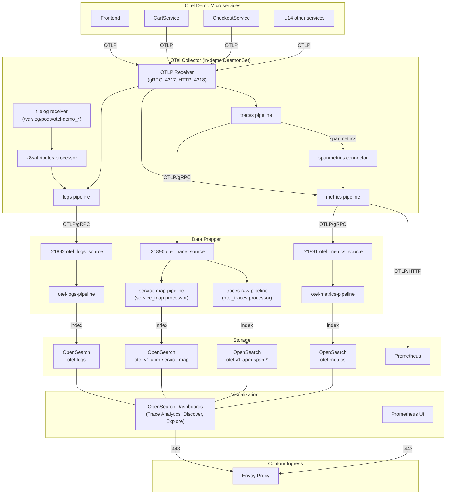

## Telemetry Signal Flows

### Traces
- **Source**: Demo microservices emit OpenTelemetry trace spans
- **Collection**: OTLP Receiver (gRPC :4317) in OTel Collector (in-demo)
- **Processing**: spanmetrics connector generates metrics from span data
- **Transport**: OTLP/gRPC to Data Prepper port 21890
- **Processing**: 
  - `otel_traces` processor converts to Trace Analytics format
  - `service_map` processor generates service dependency graph
- **Storage**: 
  - `otel-v1-apm-span-*` indices (via alias `otel-v1-apm-span`)
  - `otel-v1-apm-service-map` index
- **Visualization**: OpenSearch Dashboards > Observability > Trace Analytics

### Metrics
- **Source 1**: Demo microservices emit OpenTelemetry metrics (OTLP)
- **Source 2**: spanmetrics connector generates RED metrics from traces
- **Collection**: OTLP Receiver (gRPC :4317, HTTP :4318) in OTel Collector
- **Processing**: batch processor
- **Transport**: 
  - OTLP/HTTP push to Prometheus (port 9090, OTLP receiver enabled)
  - OTLP/gRPC to Data Prepper port 21891
- **Processing**: `otel_metrics` processor (in Data Prepper)
- **Storage**: 
  - Prometheus (time-series DB)
  - `otel-metrics` index in OpenSearch
- **Visualization**: 
  - Prometheus UI (http://prometheus:9090)
  - OpenSearch Dashboards > Discover (otel-metrics index)

### Application/SDK Logs
- **Source**: Demo microservices emit structured logs via OpenTelemetry SDK
- **Collection**: OTLP Receiver (gRPC :4317, HTTP :4318) in OTel Collector
- **Processing**: batch processor
- **Transport**: OTLP/gRPC to Data Prepper port 21892
- **Processing**: `otel_logs` processor
- **Storage**: `otel-logs` index in OpenSearch
- **Visualization**: 
  - OpenSearch Dashboards > Discover (otel-logs* index)
  - OpenSearch Dashboards > Explore

### Container Logs (stdout/stderr)
- **Source**: Raw container output from all otel-demo pods
- **Collection**: filelog receiver in the in-demo OTel Collector DaemonSet reads `/var/log/pods/otel-demo_*/*/*.log`
- **Parsing**: Detects CRI/Docker/containerd log format and parses JSON/text
- **Enrichment**: k8sattributes processor adds pod name, namespace, deployment, node info
- **Transport**: OTLP/gRPC to Data Prepper port 21892 (same as SDK logs)
- **Processing**: `otel_logs` processor
- **Storage**: `otel-logs` index in OpenSearch (mixed with SDK logs)
- **Visualization**: 
  - OpenSearch Dashboards > Discover (otel-logs* index)
  - Filter by `kubernetes.pod.name` to see container-specific logs

## Data Prepper Pipelines

### otel-trace-pipeline
- **Source**: `otel_trace_source` (port 21890)
- **Sinks**: Routes to both traces-raw-pipeline and service-map-pipeline

### traces-raw-pipeline
- **Processor**: `otel_traces` - converts OpenTelemetry span format to Trace Analytics format
- **Sink**: OpenSearch index `otel-v1-apm-span-*` (via alias)
- **Purpose**: Stores individual span records for trace inspection

### service-map-pipeline
- **Processor**: `service_map` - aggregates spans to build service dependency graph
- **Sink**: OpenSearch index `otel-v1-apm-service-map`
- **Purpose**: Shows relationships between services, latency, error rates

### otel-metrics-pipeline
- **Source**: `otel_metrics_source` (port 21891)
- **Processor**: `otel_metrics` - processes metric data
- **Sink**: OpenSearch index `otel-metrics`
- **Purpose**: Long-term metrics storage in OpenSearch (complementary to Prometheus)

### otel-logs-pipeline
- **Source**: `otel_logs_source` (port 21892) - receives both SDK logs and container logs
- **Processor**: None (logs pass through)
- **Sink**: OpenSearch index `otel-logs`
- **Purpose**: Unified log storage for both application and container logs

## Access Points

| Component | URL | Port |
|---|---|---|
| **Astronomy Shop** | https://shop.10.138.169.33.sslip.io | 443 |
| **OpenSearch Dashboards** | https://dashboards.10.138.169.33.sslip.io | 443 |
| **Prometheus UI** | https://prometheus.10.138.169.33.sslip.io | 443 |
| **OpenSearch API** | http://opensearch-cluster-master.opensearch.svc:9200 | 9200 (internal) |
| **Data Prepper Traces** | data-prepper.opensearch.svc:21890 | 21890 (internal) |
| **Data Prepper Metrics** | data-prepper.opensearch.svc:21891 | 21891 (internal) |
| **Data Prepper Logs** | data-prepper.opensearch.svc:21892 | 21892 (internal) |

## Index Mapping Summary

| Index Pattern | Type | Source | Use Case |
|---|---|---|---|
| `otel-v1-apm-span-*` | Trace Analytics | Spans from demo apps | Individual span inspection, trace waterfall views |
| `otel-v1-apm-service-map` | Service Map | Service dependency aggregation | Service topology, latency between services |
| `otel-logs*` | Custom | SDK logs + container logs | Application and system log search, troubleshooting |
| `otel-metrics` | Custom | Metrics from demo apps | Long-term metrics storage in OpenSearch |

## Notes

- **TLS**: All external endpoints use self-signed certificates via cert-manager
- **Security Plugin**: Disabled in OpenSearch for this demo setup
- **Persistence**: OpenSearch uses emptyDir (ephemeral storage) - data is lost on pod restart
- **Namespaces**: 
  - `otel-demo` - demo microservices + in-demo OTel Collector
  - `opensearch` - OpenSearch, Dashboards, Data Prepper
  - `monitoring` - Prometheus Operator (kube-prometheus-stack)
  - `projectcontour` - Contour ingress controller (pre-installed)
